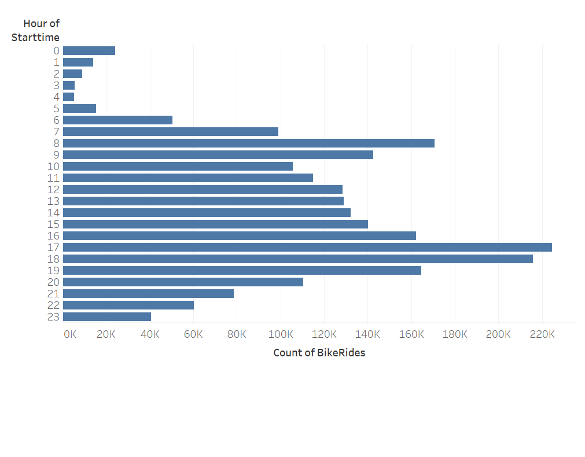
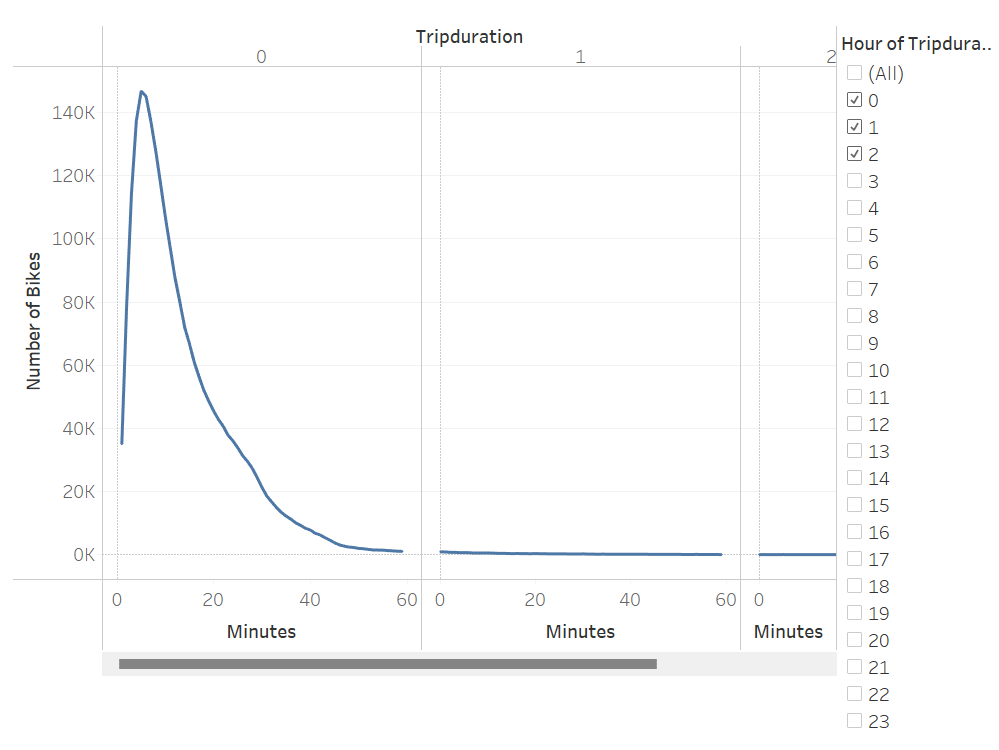
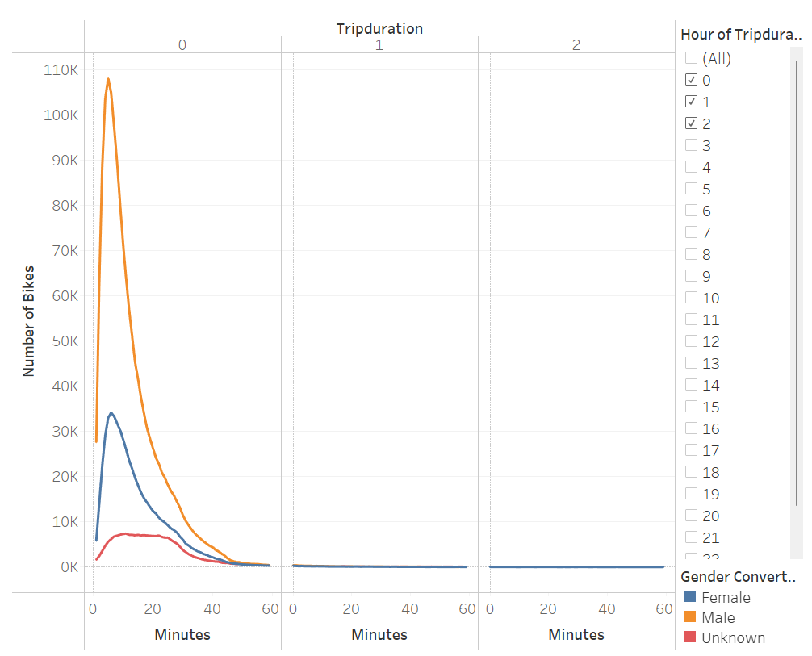
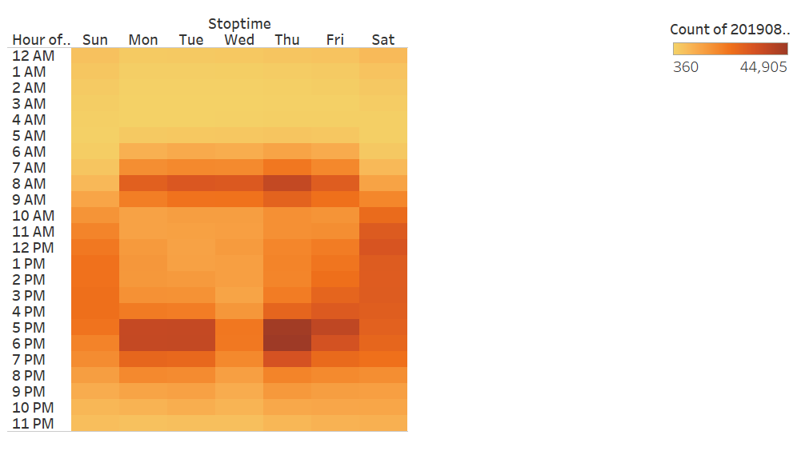
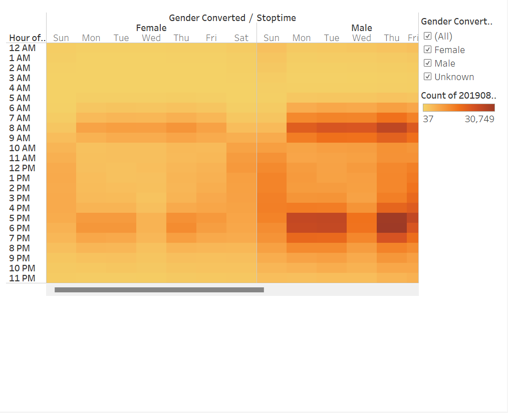
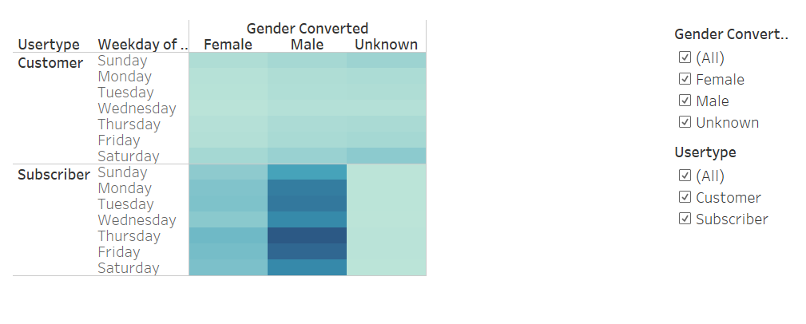

# Bikesharing

## Overview of the analysis
Last summer Kate and her friend took the trip of a lifetime. New York City for two full weeks exploring historic landmarks
like Central Park, the Statue of Liberty, and the Empire State Building.
It was a magical experience and as they flew home together they looked through their vacation photos and had a realization.
One of the key ingredients to the magic was an unlikely suspect, Citi Bike. Friends had biked everywhere which allowed them
to really get to know the city and interact with the people who live there and who are using bikes for their commutes.
A gem of an idea starts to form in their mind. What if they could start a similar bike share business for their hometown of Des
Moines, Iowa. Kate and her friend start brainstorming and a few weeks later they had a 
potential angel investor to explore a bike-share program in Des Moines. This is an exciting prospect but they know they have to think
realistically. The mechanics of making this business work might be quite different in Des Moines than in New York City. They decide
that the first step is to figure out how the bike-share business actually works in New York City. From there they'll create a
proposal on how it might work in Des Moines. 

The aim of this project is to use Citi Bike data that has been released to the public to do our bike trip analysis  in New York and
convince investors that a bike-sharing program in Des Moines is a solid business proposal.

For this analysis, we are using Pandas to change the "tripduration" column from an integer to a datetime datatype. Then, using the
converted datatype, we are creating a set of visualizations to:  
* Show top starting locations;  
* Show peak hours of bike usages;  
* Show the length of time that bikes are checked out for all riders and genders;  
* Show the number of bike trips for all riders and genders for each hour of each day of the week;  
* Show the number of bike trips for each type of user and gender for each day of the week.  

## Results: Using the visualizations you have in your Tableau Story, describe the results of each visualization underneath the image.

## Summary: Provide a high-level summary of the results and two additional visualizations that you would perform with the given dataset.